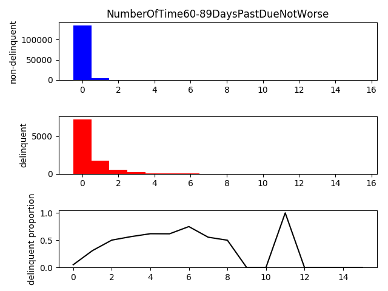
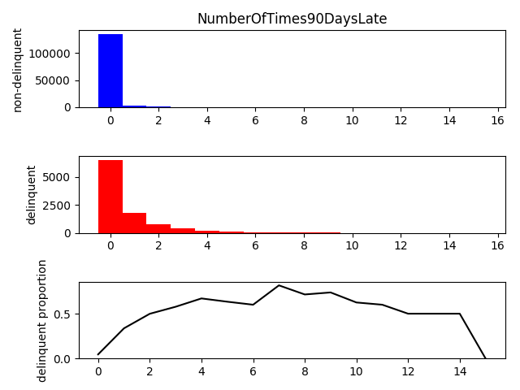

# Analysis

## Problem

https://www.kaggle.com/c/GiveMeSomeCredit

This is a supervised learning regression problem.

## Datasets

### Features distribution

We plotted the distribution of features on the training and test datasets. There is no statistically significant difference between the datasets. For some plots we did not cover the entire range to improve legibility.

For each feature we plotted the distribution of non-delinquent and delinquent individuals, and the proportion of delinquents. For some plots we did not cover the entire range to improve legibility.

Over statistically significant intervals there is a law linking the value of each feature and the proportion of delinquents. For instance age and delinquency are linearly related in the working-age population (25-70 years old). Similarly there is an inverse power law linking incomes > 1000 and delinquency.

### Features correlation

We analyzed the Pearson and Spearman correlations between the features. There are some expected correlations, for instance between age and income, or age and number of dependents. One remarkable fact is the strong linear correlation between the 3 features representing the number of times a payment was late (30-59, 60-89, and 90 days).

#### Training dataset, top 10 Pearson correlation coefficients

    0.992796182594 NumberOfTimes90DaysLate x NumberOfTime60-89DaysPastDueNotWorse
    0.98700544748 NumberOfTime30-59DaysPastDueNotWorse x NumberOfTime60-89DaysPastDueNotWorse
    0.983602681283 NumberOfTime30-59DaysPastDueNotWorse x NumberOfTimes90DaysLate
    0.433958603056 NumberOfOpenCreditLinesAndLoans x NumberRealEstateLoansOrLines
    -0.213302578045 age x NumberOfDependents
    0.147705318271 age x NumberOfOpenCreditLinesAndLoans
    0.125586964573 SeriousDlqin2yrs x NumberOfTime30-59DaysPastDueNotWorse
    0.124958961095 MonthlyIncome x NumberRealEstateLoansOrLines
    0.124684285213 NumberRealEstateLoansOrLines x NumberOfDependents
    0.120046028125 DebtRatio x NumberRealEstateLoansOrLines

#### Training dataset, top 10 Spearman correlation coefficients

    0.472817452505 NumberOfOpenCreditLinesAndLoans x NumberRealEstateLoansOrLines
    0.400238543826 DebtRatio x NumberRealEstateLoansOrLines
    0.391131541 MonthlyIncome x NumberRealEstateLoansOrLines
    0.34234942221 SeriousDlqin2yrs x NumberOfTimes90DaysLate
    0.320972444111 NumberOfTimes90DaysLate x NumberOfTime60-89DaysPastDueNotWorse
    0.311968689869 MonthlyIncome x NumberOfOpenCreditLinesAndLoans
    0.279806698373 NumberOfTime30-59DaysPastDueNotWorse x NumberOfTime60-89DaysPastDueNotWorse
    -0.278340487195 RevolvingUtilizationOfUnsecuredLines x age
    0.27711062963 SeriousDlqin2yrs x NumberOfTime60-89DaysPastDueNotWorse
    0.257411003285 SeriousDlqin2yrs x NumberOfTime30-59DaysPastDueNotWorse

## Data clean-up

### Missing data

There is missing data for two features: income and number of dependents. We filled in the missing data with -1. The replacement value is arbitrary, but outside the normal range for each feature. This is so that a model might learn from the fact the values were missing, even if we don't know the reason.

### Outliers

There are some obvious outliers. For instance one person has 43 dependents and another is 0 year old. There are however very few such cases, and we judged them not worth repairing given the datasets sizes.

The values 96 and 98 are used repeatedly in the 3 features representing the number of times a payment was late. The number of such occurrences indicates it is unlikely to be a mistake. It might instead be a code. However a model might learn from such values, because although incorrect they are consistent. We hence left them unchanged.

## Model

### Score

We used K-fold cross-validation on the training dataset to estimate the area under ROC curve of models. This allows us to estimate the Kaggle score without submitting repeatedly. For this challenge the submissions are limited to 2 per day.

### Model type

Based on the analysis above we used a gradient boosting regressor. The main advantages are listed below.

- Few assumptions on the data to fit
  - No need to follow specific distribution laws
  - No need for scaling or shifting
  - No issue with correlated features
- Learns fast
- Performs well in practice

The estimated area under ROC curve for the initial model is 0.8640.

### Tuning

We used a grid search to tune the following model hyperparameters: max_depth=4, n_estimators=130. Other hyperparameters did not yield significant improvements.

The estimated area under ROC curve is now 0.8649.

### Variance reduction

Gradient boosting reduces the error bias but might increase the variance. In order to reduce the variance we used bootstrap aggregation on the tuned gradient boosting regressors.

The estimated area under ROC curve is now 0.8654.

### Tuning

We tuned the following bootstrap aggregation regressor hyperparameter: n_estimators=30.

The estimated area under ROC curve is now 0.8656

## Submission

We submitted the prediction from our last model to Kaggle.

### Private leaderboard

- Score: 0.868039
- Rank: 58

### Public leaderboard

- Score: 0.861483
- Rank: 89

# Code

## Setup

    virtualenv -p python3 venv
    source venv/bin/activate
    pip install -r requirements.txt

## Analysis

Generate the plots.

    python3 plot.py

List the correlation coefficients.

    python3 correlation.py

Evaluate the model and generate a submission.

    python3 model.py

If generated again the submission will be different due to randomization in the learning algorithm. The performance should however be comparable.
